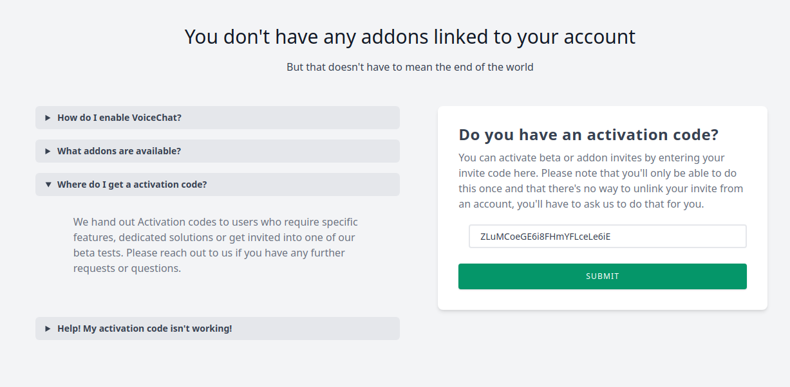

[//]: # (TITLE:Craftmend Accounts)
[//]: # (ICON:far fa-question-circle)
[//]: # (DESCRIPTION:What are Craftmend Accounts)
[//]: # (TAGS:accounts,craftmend,email,addons,install)

# **Accounts**
### Do I need an account?
No, perhaps not. OpenAudioMc will work just fine without an account, but some features are uniquely available through the online admin panel.
Unverified servers might be connection limited in the future to prevent abuse, but we'll let you know when this goes into action.

### Do I need to share my account?
No, certainly not. Other staff members can get access to the server by following the same linking instructions if they have their own account, and the server will be transferred to their account and will keep all its settings.

### Addon Installation
Some beta or restricted features are currently installed through add-ons, which goes on a per-profile basis.
You'll get an activation code when you get accepted for a special feature, these codes are just random strings of characters (like `ZLuMCoeGE6i8FHmYFLceLe6iE`) and can only be used **once**, so keep them to yourself to prevent others from running off with it.

To activate your add-on, head over to the add-ons page and enter your activation code in the text box, then hit submit.

Your new add-on will now appear in the list on the left, this is where all your add-ons will be shown, along with a short description.
Click the newly added add-on to start its initial installation (you can click some add-ons again to change their settings after the fact, but voice chat which is used in this example has a one-time permanent setup)

A small popup will then appear, guiding you through the setup step by step. Pay close attention, your initial installation cannot be undone, and you may be asked to restart your server afterwards!
 

### Automation Process
Some servers scale their servers dynamically, which often involves new servers being made from templates with their "default" settings.
We do offer an add-on for this (PersistentFingerprints), which gives you a set of permanent fingerprints that you can set as environment variables in your containers to automate server validation and linking. Please contact us through the discord to request an activation code for this add-on, and we'll hook you up.