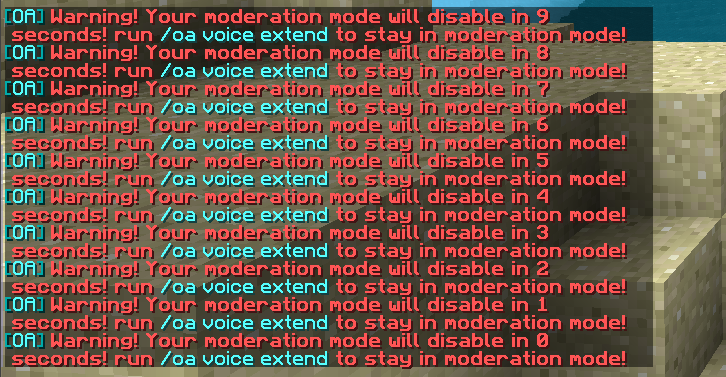

[//]: # (TITLE:Proximity Voice Chat Moderation)
[//]: # (ICON:fas fa-user-shield)
[//]: # (DESCRIPTION:How to moderate your player experience with Mutes and bans)
[//]: # (TAGS:voice,voicechat,proximity,talking,calling,calls)
[//]: # (COMMANDS:/oa pv inspect {username},Loads a GUI showing names of the 15 most recent players that they talked to, when they were last seen, as well as allowing you to ban them from using Proximity Voice Chat at all.)
[//]: # (COMMANDS:/oa vc inspect {username},Loads a GUI showing names of the 15 most recent players that they talked to, when they were last seen, as well as allowing you to ban them from using Proximity Voice Chat at all.)
[//]: # (COMMANDS:/oa voice inspect {username},Loads a GUI showing names of the 15 most recent players that they talked to, when they were last seen, as well as allowing you to ban them from using Proximity Voice Chat at all.)
[//]: # (COMMANDS:/oa voicechat inspect {username},Loads a GUI showing names of the 15 most recent players that they talked to, when they were last seen, as well as allowing you to ban them from using Proximity Voice Chat at all.)
[//]: # (COMMANDS:/oa proximity inspect {username},Loads a GUI showing names of the 15 most recent players that they talked to, when they were last seen, as well as allowing you to ban them from using Proximity Voice Chat at all.)

# VoiceChat Moderation
Playing with your friends is fun, but some players can really sour an entire community.

We provide a handful of utilities to server moderators, allowing them to check in with players, validate reports and completely ban players from voice chat.

## Inspect
The inspect command (`/oa voide inspect {username}`) is used to manage players (online and offline). It shows a list of recent peers (other players they talked to), their current status (if they're connected) and provides a ban option (where you can kick them from their current call, and prohibit them from using voice-chat again)

## Moderation Mode
::warningstart::<strong>WARNING!</strong> This feature needs to be enabled in the config, as it's disabled by default to prevent abuse.::warningend::
In some cases, moderators may need to listen in on a conversation to validate a report, as bad actors usually stop as soon as they see any form of enforcement. To aid moderators, we've added a moderation mode that allows them to do just that.
It can be toggled on/off with the command `/oa voice mod` (requires the permissions `openaudiomc.commands.voice`). When enabled, all other moderators will receive an in-game notification (`ToetMats started moderating`) and the player won't be visible or audible in voicechat, but can still walk up to and hear other players.

Since it has no visual artifacts or limitations, moderators may forget to disable it after a while or use it for other purposes; therefore, it'll automatically disable itself after a configured amount of time (2 minutes by default). Moderators will receive an in-game countdown during the last 15 seconds, reminding them to extend it if they're still using it.

